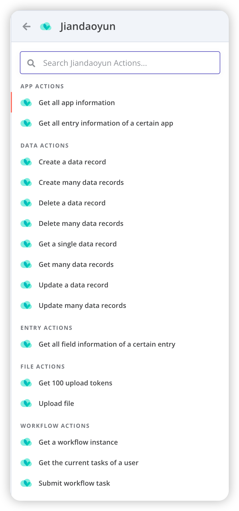
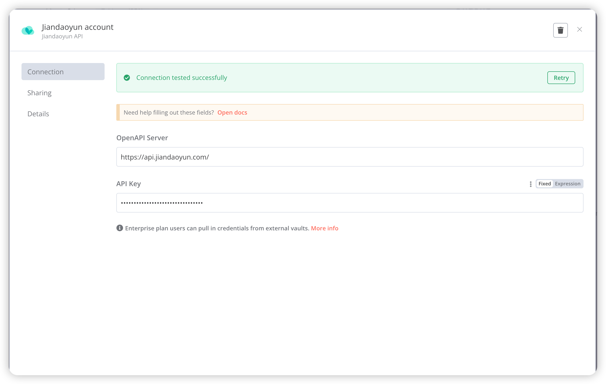

# n8n-nodes-jiandaoyun

This is an n8n community node. It lets you use [JianDaoYun(简道云)](https://www.jiandaoyun.com) / [Jodoo](https://www.jodoo.com) in your n8n workflows.

[JianDaoYun(简道云)](https://www.jiandaoyun.com) / [Jodoo](https://www.jodoo.com)  is a no-code platform that allows you to build your own custom software.

[n8n](https://n8n.io/) is a [fair-code licensed](https://docs.n8n.io/reference/license/) workflow automation platform.

[Installation](#installation)  
[Operations](#operations)  
[Credentials](#credentials)  <!-- delete if no auth needed -->
[Resources](#resources)

## Installation

Follow the [installation guide](https://docs.n8n.io/integrations/community-nodes/installation/) in the n8n community nodes documentation.

## Operations

## Credentials

[JianDaoYun(简道云)](https://www.jiandaoyun.com) / [Jodoo](https://www.jodoo.com) uses simple token-based authentication method.

You can get your API Key reference from [Jiandaoyun](https://hc.jiandaoyun.com/open/10992#22%E5%88%9B%E5%BB%BAapikey) / [Jodoo](https://help.jodoo.com/open/11261#authenticationmethod).

The available OpenAPI Servers are:
- Jiandaoyun: https://api.jiandaoyun.com/
- Jodoo: https://api.jodoo.com/
- Dev: https://dev.jiandaoyun.com/ (for development only)
